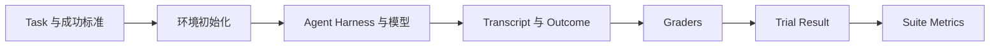

# 现实世界里的 Agent Eval，从四个开源项目理解评估系统如何运转

做 Agent 最舒服的时候，往往是 Demo 刚刚跑通的那几天。

你准备几个看起来像真实需求的任务，改一版 prompt，接上两三个工具，跑出来的结果不错。团队里的人轮流试一遍，也觉得它挺聪明。功能就这样继续往前迭代。

麻烦通常出现在后面。

有人调整了 system prompt，觉得回答更稳了，另一个人却觉得它开始啰嗦。模型升级之后，复杂任务似乎做得更好，工具调用成本却翻了一倍。线上出现一个失败案例，本地重新跑三遍，其中两遍又成功了。好不容易修掉这个问题，谁也不知道其他能力有没有跟着退化。

大家只能围着几条 transcript 讨论。

「我感觉新版更好。」

「但这个任务以前明明能过。」

「会不会只是这次运气不好？」

这种讨论很难产生可靠结论，因为团队缺少的不是更多感觉，而是一套能稳定制造证据的反馈系统。

这就是 Agent Eval 开始变得重要的时刻。

[Anthropic 在关于 Agent Eval 的文章中](https://www.anthropic.com/engineering/demystifying-evals-for-ai-agents)提到，Claude Code 早期也主要依赖员工试用和外部用户反馈。随着产品逐渐成熟，他们开始为简洁性、文件编辑、过度工程等具体行为建立 Eval。Eval 在这里并不是为了做一张对外排行榜，而是把「Agent 好像变差了」翻译成可以重复运行、可以比较版本、可以定位原因的问题。

这点很重要。

很多人第一次接触 Eval，会把它理解成给模型出一套题，然后统计正确率。这个理解放在单轮问答上或许够用，放到 Agent 身上，就会漏掉大量真正困难的部分。

Agent 会连续决策，会调用工具，会改变文件、数据库和应用状态，还会根据中间结果修正计划。一次错误的工具调用不只是答错一道题，它可能直接改变后续所有步骤赖以判断的环境。最终回复写着「已经完成」，数据库里却没有订单，文件也根本没保存，这种情况在 Agent Eval 里并不少见。

更麻烦的是，同一个 Agent 面对同一个任务，第一次可能成功，第二次可能失败。你评估的也不只是一个模型，而是模型、prompt、工具定义、权限、上下文管理和 agent harness 组合起来的整个系统。任何一层发生变化，都可能让结果发生变化。

所以，Agent Eval 至少有六个绕不开的难点。

一是多轮决策会让错误逐步传播。二是模型输出存在随机性，单次运行不能代表稳定能力。三是被测对象包含模型和 agent harness，分数很难只归因于模型。四是成功标准经常同时包含结果正确性、过程约束和交互质量。五是环境、网络和外部服务也可能制造失败。六是 task 和 grader 自己可能写错，甚至比 Agent 更先出问题。

这些话只停留在理论里，很容易变成一串正确但抽象的原则。

真正有意思的，是把现实世界里的 Eval 项目放到一起看。

Terminal-Bench 要在隔离终端里编译代码、配置服务器，再用测试脚本验收结果。τ²-bench 要安排另一个模型扮演用户，还要检查对话之后的数据库状态。DeepResearch Bench 接收一篇篇长报告，分别判断内容质量与引用是否可信。OSWorld 更复杂，它要启动完整虚拟机，让 Agent 通过鼠标和键盘操作真实桌面应用。

它们都在做 Agent Eval，却选择了完全不同的环境、证据和 grader。

顺着这些差异往下拆，Agent Eval Harness 的完整轮廓才会慢慢显现出来。

> 本文基于项目源码与官方文档调研，不代表我完整复现过四套 Benchmark。文中项目状态核对至 2026 年 7 月 30 日。

## 一次 Agent Eval 到底是怎么流动的

在进入具体项目之前，需要先建立一套共同语言。

最简单的 Eval，是给模型一个输入，拿到输出，再用评分逻辑判断结果。Agent Eval 在这条链路中加入了环境、工具和多轮交互，流程大致如下。

一个 **Task** 是一道具体任务，它不只有输入，还应该包含环境、可用工具和成功标准。

Agent 每尝试完成一次 Task，就产生一个 **Trial**。同一个 Task 通常需要执行多个 Trial，因为模型的输出并不稳定。

Trial 运行时产生的完整消息、推理、工具调用、工具返回和中间状态，构成 **Transcript**，也经常被称为 Trace 或 Trajectory。

Agent 执行结束后，环境里真正留下的状态叫 **Outcome**。航班 Agent 说自己完成了订票属于 Transcript 的一部分，数据库里是否真的存在预订记录，才是 Outcome。

负责检查 Outcome 或 Transcript 的逻辑叫 **Grader**。一个任务可以有多个 grader，分别检查正确性、合规性、交互质量和资源消耗。

一组用于衡量同类能力或行为的 Task 叫 **Evaluation Suite**。多个 Task、多个 Agent、多个模型产生的大量 Trial，最终被聚合成我们看到的成功率、reward、pass@k 等指标。

这里还有两个特别容易混淆的词。

**Agent Harness** 是把模型变成 Agent 的那套系统。它管理消息循环、工具调用、上下文、重试和结束条件。Claude Code、OpenHands 或一个团队自己写的 Agent Runtime，都属于 agent harness。

**Evaluation Harness** 则站在外面。它准备任务和环境，启动被测 Agent，记录全过程，运行 grader，管理并发和超时，最终汇总结果。

也就是说，我们平时说「评估一个 Agent」，实际评估的是模型和 agent harness 的组合。Evaluation harness 才是负责测量这个组合的系统。

Benchmark 也不等于 Harness。Benchmark 通常是一组标准化 Task 和数据，grader pipeline 可能只负责给已有输出打分，evaluation harness 才负责从环境初始化一直运行到结果聚合。

后面会看到，DeepResearch Bench 更接近 Benchmark 加 grader pipeline，而 Harbor 和 OSWorld 则包含更完整的 Agent 执行能力。

一套可信的 Agent Eval，无论最终长成什么样，都得回答五个问题。

给 Agent 什么任务。把它放进什么环境。被测的模型和 harness 是什么版本。运行过程中要保存哪些证据。根据什么证据确认成功。

四个开源项目的差异，大都发生在这五个问题上。

## Harbor 与 Terminal-Bench 2.0，一次完整 Trial 如何执行

先从结构最容易看清的一类开始，终端 Agent。

[Terminal-Bench](https://github.com/harbor-framework/terminal-bench) 测试的是 Agent 在真实终端环境里完成复杂技术任务的能力，包括编译代码、训练模型、配置服务等。它早期同时提供任务数据和执行 Harness。现在仓库已经明确建议新用户使用 [Harbor](https://github.com/harbor-framework/harbor) 运行 Terminal-Bench 2.0。Harbor 的[核心概念文档](https://www.harborframework.com/docs/core-concepts)则把这套执行模型归纳为 Task、Trial、Job、Agent、Environment 与 Verifier。

这层关系可以简单理解为，Terminal-Bench 2.0 提供要考什么，Harbor 负责怎么把考试稳定运行起来。

在 [Harbor 的 Task 格式](https://www.harborframework.com/docs/tasks)里，一个任务目录通常包含下面几部分。

- `instruction.md` 保存 Agent 能看到的任务说明。
- `task.toml` 保存任务版本、资源、超时、网络策略和其他配置。
- `environment/` 定义 Agent 要进入的容器环境。
- `solution/solve.sh` 是可选的参考解法，Oracle Agent 可以用它验证任务确实可解。
- `tests/test.sh` 负责执行最终验证，并写出 reward。

这套目录看着朴素，实际已经包含了一道可靠 Agent Task 最重要的三个元素。

明确的指令，可复现的环境，可执行的成功标准。

Task 被加载后，Harbor 会根据配置创建 Trial。它准备容器，向环境放入初始文件和依赖，再通过 Agent Adapter 启动指定的 Agent 和模型。Agent 在容器内阅读任务、运行命令、修改状态，Harness 则记录 trajectory 和日志。

Agent 结束或超时之后，Harbor 收集需要验收的 artifacts，再运行 verifier。`tests/test.sh` 可以用 pytest、命令返回值或其他程序验证结果，并把单个分数写入 `reward.txt`，也可以通过 `reward.json` 写出多项数值指标。

到这里，一个 Trial 才算完成。

注意，不是 Agent 输出一句「done」就完成了，也不是进程正常退出就算成功。真正决定 reward 的，是 verifier 看到的环境状态。

这也是 Terminal-Bench 最容易迁移到真实业务的一点。编码和终端任务通常存在相对可靠的确定性证据。代码能不能运行，测试能不能通过，服务是否真的监听端口，生成文件是否满足格式，这些都比对 Agent 最终回复做文本匹配更可信。

Reference solution 的作用也常被低估。

它不只是给人看的标准答案。用 Oracle Agent 在同一环境里执行 reference solution，可以确认 Task 本身可解、环境依赖齐全、测试逻辑能够接受一个已知正确的结果。Anthropic 在原文里举过一个 Terminal-Bench 审计案例，任务要求 Agent 写脚本，却没有在说明中指定路径，测试又偷偷假设了一个固定路径。Agent 即使完成了用户显式要求，也会被判失败。

这种失败，测到的不是 Agent 能力，而是任务描述和 grader 之间的缝隙。

Harbor 还支持让 verifier 运行在单独环境中。Agent 所在环境只把声明过的 artifact 交给 verifier，评分代码和评分密钥不必暴露给 Agent。对于存在作弊风险、私有测试或独立依赖的任务，这种隔离很关键。

如果 Agent 能读取或修改 grader，它测到的就不再是完成任务的能力，而是寻找评分漏洞的能力。Agent 越强，这个问题越不能靠自觉解决。

Trial 结束后，[Harbor 的结果查看器](https://www.harborframework.com/docs/run-jobs/run-evals)还能展示 reward、耗时、错误、token 使用、trajectory、verifier 输出和 artifacts，并支持不同 Job 之间的对照。它做的不只是把结果存进一个 JSON 文件，而是让人可以回到一次失败现场，判断问题究竟发生在哪一层。

从 Harbor 和 Terminal-Bench 可以得到第一组很扎实的结论。

环境和 verifier 不是 Eval 的附属设施，它们就是测量系统的一部分。Task 也不只是一段 prompt，而是任务说明、执行环境和成功标准的组合。一次 Trial 失败，更不能自动写进模型的罪状。

## τ²-bench，对话 Agent 为什么需要另一个 Agent 扮演用户

终端任务至少有一个便利之处，成功结果经常可以通过测试程序直接验证。

换成客服或业务对话 Agent，事情一下就复杂了。

用户不会像单元测试那样稳定。他可能隐瞒信息、表达含糊、改变主意，也可能要求 Agent 做违反 Policy 的操作。Agent 不只要把话说得得体，还要调用工具真正完成退款、改签或取消订单。

[τ²-bench](https://github.com/sierra-research/tau2-bench) 的核心设计，就是把 Agent、用户和业务环境同时放进模拟中。当前仓库已经演进到包含语音和知识检索能力的 τ³-bench，本文聚焦的仍是 τ²-bench 奠定的文本双控制环境。

在[标准的半双工 Orchestrator](https://github.com/sierra-research/tau2-bench/blob/main/src/tau2/orchestrator/README.md) 里，Agent 和 User Simulator 轮流生成完整消息。Agent 可以调用业务工具改变 Environment，User Simulator 也根据自己的角色说明、目标和可用信息作出回应。官方文档把这条链路画得很直接。

`Agent → User → Agent → Tool Call → Environment → Tool Result → Agent`

这和固定几轮对话脚本完全不同。

如果预先写死用户每一句话，Agent 只要换一种问法，脚本就可能接不下去。User Simulator 的价值，是让用户能够根据当前对话动态回应，从而测试更真实的澄清、协商和异常分支。当然，它也引入了新的随机性和模拟偏差，后面分析结果时必须把这些影响算进去。

τ²-bench 的评分设计更值得看。

以航空、零售和电信领域的默认设置为例，最终 reward 通常由 `DB` 与 `COMMUNICATE` 等部分共同决定。`DB` 检查 Agent 操作之后的数据库状态，`COMMUNICATE` 检查应该告知用户的信息是否真的说清楚。

任务数据中还会出现一组 reference actions。很容易产生的误解是，Agent 必须按照这些 action 的顺序逐个调用工具。

但 [τ²-bench 的官方评分文档](https://github.com/sierra-research/tau2-bench/blob/main/docs/evaluation.md)说得很清楚，reference actions 通常只是一个已知可行的参考轨迹。Harness 会在干净的 Gold Environment 中重放它们，得到目标数据库状态，再把这个状态与 Agent 运行后的数据库状态比较。

只要 Outcome 等价，Agent 走另一条有效路径也可以通过。

只有少量显式启用 `ACTION` reward 的任务，才会要求匹配指定 action。航空、零售和电信的普通任务并不默认这样做。

这个设计解决了 Agent Eval 里一个非常关键的问题。

我们究竟是在评价结果，还是在要求 Agent 模仿出题人的过程？

如果任务目标是正确完成改签，那么数据库里有没有正确的新航班记录，通常比 Agent 是否严格按照 `查询航班 → 检查舱位 → 更新订单` 的预想顺序更重要。强行锁定唯一轨迹，会惩罚那些出题人没有预料到、但实际有效的解法。

过程当然不是永远不重要。身份验证、支付授权、安全确认等步骤可能有强制顺序，某些工具也可能被 Policy 禁止调用。遇到这些场景，trajectory grader 很有价值。但它应该来自明确的安全或业务要求，而不是因为参考答案刚好这么写。

对话 Agent 还把另一个指标推到了台前，稳定性。

一个编程 Agent 如果允许同时尝试多个候选方案，只要其中一个能通过测试，产品或许仍然可用。客服 Agent 面对真实用户时却没有太多重试机会。它今天正确退款，明天又因为同样请求违反 Policy，体验依旧不可接受。

所以对话 Agent 不只关心「能不能成功」，还关心「能不能持续成功」。这正是后面 `pass^k` 比 `pass@k` 更值得关注的场景。

## DeepResearch Bench，没有标准答案的报告怎样评分

Research Agent 又把问题推向另一个方向。

如果任务是研究一个复杂产业、分析一项科学议题或完成一份尽调报告，我们很难写一个 pytest，然后宣布整篇报告通过或失败。

什么叫覆盖全面。什么叫分析有深度。引用很多是不是一定可信。不同专家会不会对同一篇报告产生不同判断。

[DeepResearch Bench](https://github.com/Ayanami0730/deep_research_bench) 选择把这些模糊问题拆开。它包含 100 个由领域专家设计的研究任务，覆盖 22 个领域，其中中英文任务各 50 个。更值得关注的不是任务数量，而是它把评分分成了 RACE 与 FACT 两条互补管线。

RACE 是 Reference-based Adaptive Criteria-driven Evaluation。它会根据具体任务生成评价标准，从覆盖度、分析深度、指令遵循和可读性四个维度评分，同时参考高质量报告，并为不同任务动态分配权重。

FACT 处理的是另一件事。

它从报告中抽取事实声明和对应 URL，去除重复项，抓取网页内容，再通过模型判断来源是否真的支持声明，并计算 citation accuracy 和 effective citations 等指标。

这两条管线放在一起，解决了一个很容易被混淆的问题。

一篇报告写得完整、流畅、有洞察，不代表其中的事实都有可靠依据。一篇报告引用几十个链接，也不代表这些链接真的支持旁边那句话。

质量和可信度需要分别测量。

DeepResearch Bench 还有一个非常适合解释项目边界的地方。它要求使用者先在外部运行 Research Agent，再把生成的报告保存为指定 JSONL，随后运行 RACE 和 FACT。它并不负责替你启动 Research Agent、提供搜索环境或记录完整研究 trajectory。

所以更准确地说，它是 Benchmark 加 Grader Pipeline，而不是端到端 Evaluation Harness。

这个区分不只是术语洁癖。如果你只保存最终报告，就能评价报告质量，却很难分析 Agent 为什么漏掉关键来源、在哪一步选择了低质量网页、搜索成本是否过高。想得到这些答案，还需要外层 Harness 记录 Research Agent 的搜索、浏览、引用和写作过程。

LLM Judge 的版本问题，在这个项目里也表现得很直接。

DeepResearch Bench 在 2026 年 5 月更换官方 evaluator 时，先在人工标注子集上比较候选 Judge 与人类判断的一致性，并为新旧 evaluator 维护分开的结果迁移安排。原因并不复杂，grader 模型一旦变化，同一份报告也可能得到不同分数，历史排行榜就不再天然可比。

因此，LLM Judge 不是一个隐藏在后台、永远正确的裁判。

它也有模型版本、prompt、清洗逻辑、参考材料和随机性。要让结果可复现，这些信息都应该像被测 Agent 一样被记录和版本化。对高风险或主观任务，还需要持续拿专家标注进行校准，而不是只在第一次上线时验证一次。

## OSWorld，当运行环境比 Agent 更容易出问题

到了 Computer Use Agent，环境的重要性会变得非常直观。

[OSWorld](https://github.com/xlang-ai/OSWorld) 不是给 Agent 一个网页 DOM 或几个业务 API，而是让它进入真实的操作系统，通过截图观察桌面，用鼠标和键盘操作 Chrome、LibreOffice、GIMP 等应用。

一个 OSWorld Task 除了自然语言 instruction，还需要指定环境 snapshot、初始化 config、相关应用和 evaluator。Snapshot 决定任务从哪个桌面状态开始，config 负责准备文件、打开应用或完成其他初始化，evaluator 则在任务结束后检查真实状态。

这里的 Outcome 可能是一份保存到指定位置的演示文稿，一项应用设置，一个修改后的图片文件，也可能是浏览器或本地数据库中的状态。

依然不能只听 Agent 自己说完成了。

OSWorld 运行时会保存截图、动作和视频。它们不是为了让评测页面显得丰富，而是为了在失败后回答一连串实际问题。Agent 是否看到了弹窗。点击坐标有没有偏移。应用是不是还在加载。文件究竟有没有保存。任务执行到第几步开始偏离。

更现实的是，Agent 可能什么都没做错，Trial 依旧失败。

[OSWorld 的官方说明](https://github.com/xlang-ai/OSWorld#-experiments)明确提醒，部分任务需要 Google 账号和 OAuth2 配置，部分网站又依赖代理和网络条件。如果这些配置缺失，相关任务会直接失败，最终分数自然下降。外部网页改版、登录过期、资源不足或桌面弹窗，同样可能破坏原本可运行的任务。

所以 Computer Use Eval 必须把失败拆开。

是 Agent 看错界面，属于 Agent Failure。是初始快照没有恢复成功，属于 Environment Failure。是 evaluator 读取错了文件位置，属于 Grader Failure。是 Harness 在采集视频或控制 VM 时崩溃，属于 Harness Failure。

把它们全都记成零分，结果一定会骗人。

[OSWorld 提供 Manual Task Examination](https://github.com/xlang-ai/OSWorld)，让维护者手动执行特定任务，验证任务描述、环境和 evaluator，并记录截图与视频。这个工具传递出的态度很朴素，自动化 Eval 仍然需要人工检查自己的测量工具。

OSWorld 在 2025 年推出 Verified 版本，也修复了一批社区反馈的问题。它说明 Task 和环境不是一次写完、永久不变的静态资产，而是需要持续维护的测试产品。

## 四个项目放在一起之后

现在可以把四个项目放到同一张表里。

| 项目 | 被测对象 | 主要环境 | 主要成功证据 | 突出的 Eval 难点 |
| --- | --- | --- | --- | --- |
| Harbor / Terminal-Bench | 终端与编码 Agent | 隔离容器 | 测试结果与环境产物 | 可复现执行、隔离和验证 |
| τ²-bench | 对话工具 Agent | 用户模拟器、Policy、数据库 | 最终业务状态与沟通要求 | 多轮交互和重复可靠性 |
| DeepResearch Bench | Research Agent 报告 | 报告与外部信息源 | 多维 Rubric 与引用支持关系 | 开放式评分和 Judge 校准 |
| OSWorld | Computer Use Agent | VM 与真实桌面应用 | 文件、配置和应用状态 | 环境恢复和基础设施噪声 |

表面看，它们像四套完全不同的系统。

往下一层看，Task、Environment、Agent、Evidence、Grader、Trial 和 Aggregation 始终存在。真正变化的是每类任务把什么当作可信 Outcome，以及为了得到这个 Outcome，需要搭建多复杂的环境。

终端 Agent 的真相可能藏在测试结果里。客服 Agent 的真相藏在数据库与对话共同形成的状态里。Research Agent 的真相分散在内容质量和来源支持关系里。Computer Use Agent 的真相则藏在应用、文件和整个操作系统里。

所以，设计 Eval 的起点不应该是「我要用哪个框架」。

应该先问，什么证据足以证明我的 Agent 真的完成了任务。

## Grader 该怎么选，四个项目已经给了答案

[Anthropic 把 Agent grader 分为三类](https://www.anthropic.com/engineering/demystifying-evals-for-ai-agents)，code-based grader、model-based grader 和 human grader。

Code-based grader 包括精确匹配、正则、单元测试、静态分析、数据库状态检查和工具调用检查。它速度快、成本低、容易复现，但处理开放式输出时容易僵硬。

Model-based grader 能根据自然语言 Rubric 判断连贯性、风格、深度和指令遵循，也能比较两个候选结果。代价是成本更高、存在随机性，还可能带着 Judge 自己的偏见。

Human grader 仍然是主观质量和专业领域的重要参照，但速度慢、成本高，也存在评审者之间的不一致。

这三种 grader 不是互相替代的关系，更像三种不同精度和成本的测量工具。

Terminal-Bench 说明，只要 Outcome 能通过测试脚本验证，确定性 grader 通常应该优先。τ²-bench 说明，应该尽量验证最终业务状态，不要随意锁死唯一操作轨迹。DeepResearch Bench 说明，开放式结果需要拆成多个维度，并把引用可信度独立验证。OSWorld 则提醒我们，grader 读到的环境可能已经坏了，人工复核能力不能消失。

还有几条原则，也能在项目和 Anthropic 的实践中找到直接依据。

复杂任务应该允许 Partial Credit。客服 Agent 正确验证了用户、确认了退款资格，却在收尾时调用工具失败，它显然比一开始就答非所问更接近成功。把两者都压成零分，会丢失对研发很有价值的梯度。

LLM Judge 应该允许输出 Unknown。当证据不足时，强迫 Judge 在通过和失败之间二选一，只会制造一份看起来完整的幻觉。更稳妥的方式是按维度评分，每个维度提供明确 Rubric，再通过专家样本校准。

Grader 还要防止被绕过。Harbor 的独立 verifier 和 sidecar artifact 设计，本身就在解决评分证据是否可信的问题。对于安全敏感任务，来自 Agent 完全控制环境的日志不能自动视为可信证据。

最重要的一条，仍然是优先评价结果，而不是要求 Agent 表演出题人预想的过程。

Anthropic 原文提到，Claude Opus 4.5 在 CORE-Bench 上最初只有 42% 的成绩。后来研究者发现其中存在过度严格的数值匹配、含糊任务和不可复现的随机任务，并改用约束更少的 scaffold。修复后成绩升到 95%。

同一个模型，分数差了一倍多。

这个案例放在这里就很清楚了。Eval 的分数从来不只是 Agent 的属性，它是 Agent、Task、Environment、Harness 与 Grader 共同作用的结果。任何一层设计失真，排行榜上的小数点都可能精确地描述一个错误系统。

## 怎样阅读 Eval Result

运行结束之后，最容易犯的错误，是只看一个总成功率。

一个更可靠的结果面板，至少应该分成四层。

第一层是结果质量，包括 success rate、reward、partial credit，以及按照任务类型和能力维度拆开的分数。总分适合看趋势，逐任务分布才适合找问题。如果总体提升来自简单任务大幅变好，但关键高风险任务持续退化，这个升级未必值得发布。

第二层是随机性与可靠性。

假设一个 Agent 在某个固定 Task 上的单次成功概率为 \(p\)，并暂时假设各次 Trial 独立且成功概率稳定。

\[
\text{pass@k} = 1 - (1-p)^k
\]

它表示执行 \(k\) 次，至少成功一次的概率。随着 \(k\) 增加，pass@k 会越来越高。它适合可以并行尝试多个方案、只需要一个方案奏效的场景。

\[
\text{pass}^k = p^k
\]

它表示连续 \(k\) 次全部成功的概率。随着 \(k\) 增加，pass^k 会越来越低。一个单次成功率为 75% 的 Agent，连续三次都成功的概率约为 \(0.75^3 = 42.2\%\)。

对客服、支付、审批这类用户期待每次都可靠的 Agent，pass^k 往往比 pass@k 更接近真实产品要求。

当然，真实 Trial 未必完全独立。共享环境故障、同一 User Simulator 的偏差、限流和资源争抢都会制造相关性。因此除了计算指标，还应报告 Trial 数量、采样配置、置信区间和无效 Trial 比例。

第三层是执行效率，包括 turns、tool calls、输入输出 token、API 成本和端到端 wall time。Agent 最终能做对，不代表它已经适合生产。如果它为了完成一个简单退款查询调用 40 次工具、消耗几十万 token，这个结果在质量维度成功，在效率维度仍然失败。

第四层是基础设施健康度，包括环境初始化失败、timeout、网络错误、无效 Trial、grader disagreement 和重试率。OSWorld 对 OAuth 与代理配置的提醒已经说明，环境错误不单独统计，成功率就会混入大量非 Agent 因素。

原始提纲里还有 TTFT、output tokens per second 和 time to last token。它们不是没用，但更偏底层模型服务质量。Agent 可能很快吐出第一个 token，随后花十分钟走错工具流程。对 Agent 产品而言，端到端任务完成时间通常比单次模型调用的首 token 延迟更有解释力。

不要让容易采集的指标，盖过真正重要的结果。

## Capability Eval、Regression Eval 与长期维护

[Anthropic 将 Eval Suite 区分为 Capability Eval 与 Regression Eval](https://www.anthropic.com/engineering/demystifying-evals-for-ai-agents)，两者承担不同职责。

**Capability Eval** 问的是，这个 Agent 目前能做到什么，能力边界在哪里。它应该包含模型尚未稳定解决的困难任务，起始通过率可以很低，因为团队需要一座可以继续攀爬的山。

**Regression Eval** 问的是，这个 Agent 以前能做好的事，现在还能不能稳定做好。它的目标通常接近持续通过，一旦下降，就说明某个新变化破坏了已有能力。

一个 Capability Task 被持续解决之后，可以迁入 Regression Suite。反过来，如果 Capability Suite 已经接近满分，它就开始失去区分新能力的价值，需要加入更难、更长或更贴近新用户分布的任务。

现实项目一直在提醒我们，Suite 自己也会老化。

[τ-bench 仓库](https://github.com/sierra-research/tau2-bench)在 2026 年 7 月发布 v1.0.1 grading update 时，明确说明受影响领域在旧版和新版之间不可直接比较。项目还修复了错误的 expected actions、含糊指令、不可能约束和缺失的 fallback。[DeepResearch Bench](https://github.com/Ayanami0730/deep_research_bench) 更换 Judge 后需要迁移排行榜。[OSWorld](https://github.com/xlang-ai/OSWorld) 推出 Verified 版本，也是在修复 Task 和环境问题。

这些更新并不是 Benchmark 不专业的证据，反而说明高质量 Eval 必须允许自己被纠正。

所以每次结果至少要记录 Task Suite 版本、模型版本、agent harness 与 prompt 版本、环境镜像、grader 版本、随机种子和关键运行配置。少了这些信息，今天的 70 分与下个月的 73 分可能根本不是同一把尺子量出来的。

自动化也不能替代阅读 Transcript。

Anthropic 把检查 transcript 单独列为从零建设 Eval 的关键步骤。Harbor 提供 trajectory viewer，OSWorld 提供 manual examination，背后的原因是一致的。只有回到成功和失败现场，人才能判断 Agent 是真的犯错，还是 grader 拒绝了一个合理解法，或者环境根本没有正确启动。

一个好的失败，应该让人看得出哪里错了，也应该让人相信它错得公平。

## 从零搭建自己的 Agent Eval Harness

看完四个项目之后，路线反而没有想象中复杂。难的是每一步都要抵抗「先凑一个分数出来」的诱惑。

1. **先写清 Eval 要支持什么决策**

是判断新模型能否升级，是验证一版 prompt 有没有回归，是寻找 Agent 的能力上限，还是确认某个高风险流程足够可靠。决策不同，Task 难度、Trial 数量和指标都会不同。

2. **从真实失败和人工检查里收集首批 Task**

[Anthropic 建议](https://www.anthropic.com/engineering/demystifying-evals-for-ai-agents)早期可以从 20 到 50 个任务起步。人工发布前会检查什么，用户最常尝试什么，线上出现过哪些失败，就先把这些变成 Eval。早期不需要为了看起来正式而堆出几百个低质量任务。

3. **同时测试应该做与不应该做**

只测试该搜索时能否搜索，可能优化出一个什么都搜索的 Agent。只测试该退款时能否退款，也可能漏掉不满足条件时乱退款的问题。正向与负向案例必须平衡。

4. **把 Task 写到两名专家能独立判断**

任务描述里应该公开 grader 会检查的用户可见要求，不能让隐藏路径或隐含格式决定成败。为 Task 准备 reference solution 或已知可行 Outcome，先证明任务可解、环境可用、grader 能接受正确结果。

5. **先找可信 Outcome，再选 Eval 框架**

编码 Agent 可能看测试结果，客服 Agent 可能看数据库与对话，Research Agent 可能看内容维度和引用支持，Computer Use Agent 可能看文件和应用状态。先定义证据，再选择 Harbor、内部框架或其他工具承载它。

6. **确定性 Grader 优先，主观质量分维度判断**

能用状态和测试直接验证的，不要轻易交给 LLM Judge。必须使用 Judge 时，给出清晰 Rubric，拆开不同维度，允许 Unknown，并保留一批专家标注用于持续校准。

7. **让被测系统尽量接近生产**

模型、prompt、工具定义、权限、上下文管理和结束条件都应该接近真实 Agent。为了方便 Eval 而换成一个能力更弱或限制更多的 scaffold，测出来的不是生产系统。

8. **隔离 Trial，并给失败分类**

每个 Trial 从干净环境开始，避免缓存、遗留文件和共享历史泄露答案。Agent Failure、Environment Failure、Grader Failure 与 Harness Failure 分开统计，无效 Trial 不要直接当成能力失败。

9. **保存完整证据与版本**

Transcript、artifacts、grader 输出、环境日志、模型与 harness 配置都应该可追溯。只有一个最终分数的 Eval，几乎无法承担调试工作。

10. **对随机任务执行多次 Trial**

报告 pass@k 或 pass^k 之前，先根据产品场景决定关注机会还是可靠性。同步报告样本量、采样参数、置信区间和基础设施错误，避免把随机波动包装成版本提升。

11. **固定阅读成功与失败 Transcript**

失败样本帮助定位问题，成功样本则能发现 Agent 是否通过漏洞碰巧拿分。分数变化之后，抽样阅读两边的 trajectory，确认 grader 测到的行为与产品目标一致。

12. **把 Suite 当成长期维护的软件**

线上新失败进入 Regression Suite，已经饱和的 Capability Task 逐步升级，含糊或失效 Task 及时修复。Task、Environment、Harness 和 Grader 都要有版本与负责人。

做到这里，你未必拥有一个庞大的 Eval 平台。

但你已经有了一套可以相信、可以解释、可以逐步扩张的测量系统。

回头再看 Harbor、τ²-bench、DeepResearch Bench 和 OSWorld，会发现它们没有共享同一份目录结构，也没有共享同一种 grader，更没有一套适用于所有 Agent 的万能实现。

它们真正共享的，是对五个问题的持续回答。

给 Agent 什么任务。让它在什么环境里行动。保存什么证据。怎样确认成功。如何证明这次结论下次还能复现。

Agent Eval 的目标，从来不是让一个复杂系统变成排行榜上的单个数字。

而是让团队下一次再说「Agent 好像变差了」时，不必继续靠感觉争论。

可以打开证据。

看见失败。

然后，修掉它。

---

以上，既然看到这里了，如果觉得不错，随手点个赞、在看、转发三连吧，如果想第一时间收到推送，也可以给我个星标⭐～

谢谢你看我的文章，我们，下次再见。

> / 作者：卡兹克
>
> / 投稿或爆料，请联系邮箱：wzglyay@virxact.com
