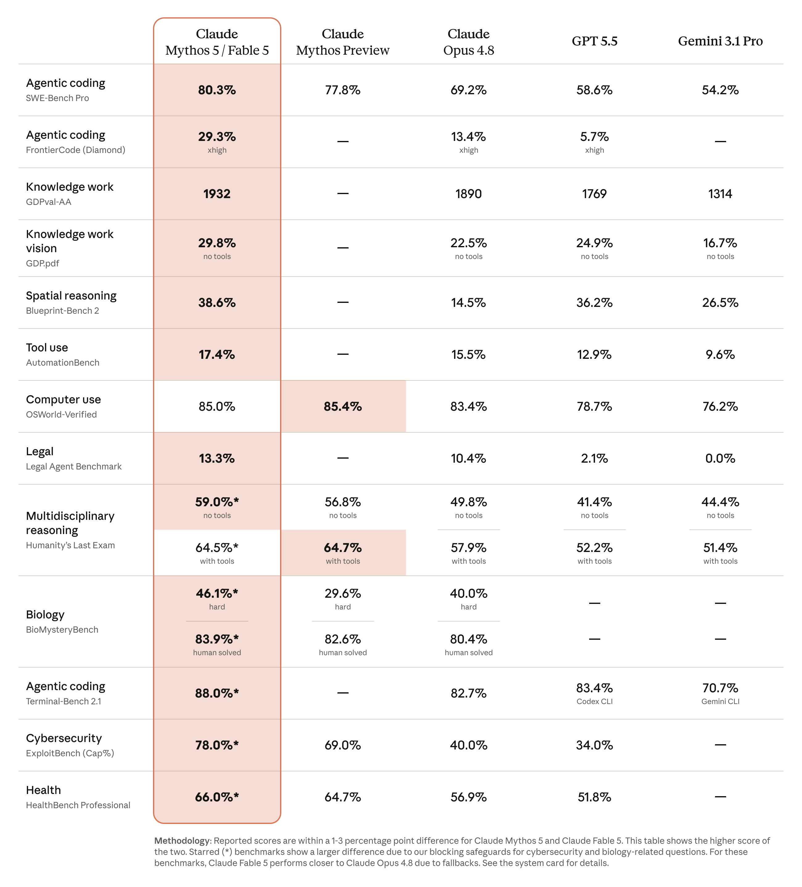
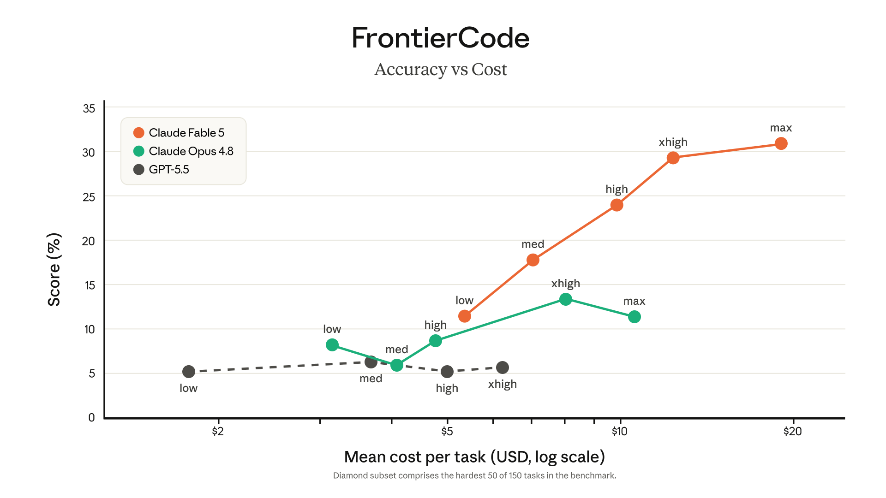
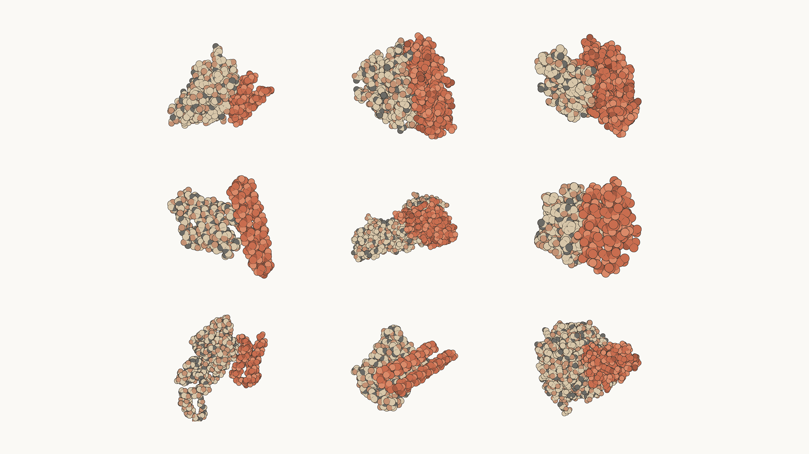
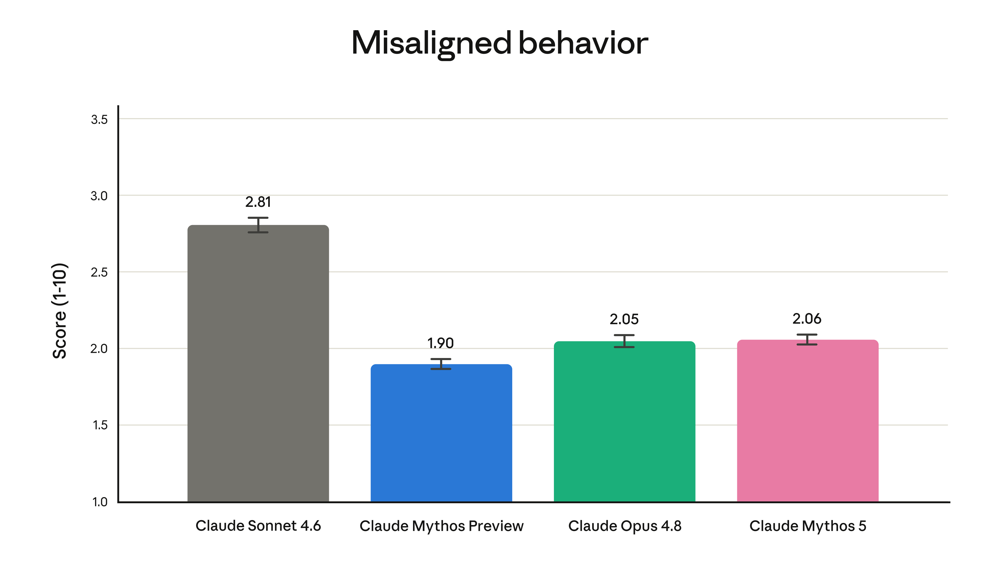
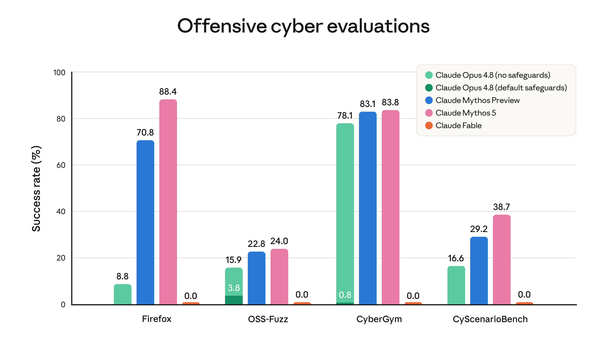
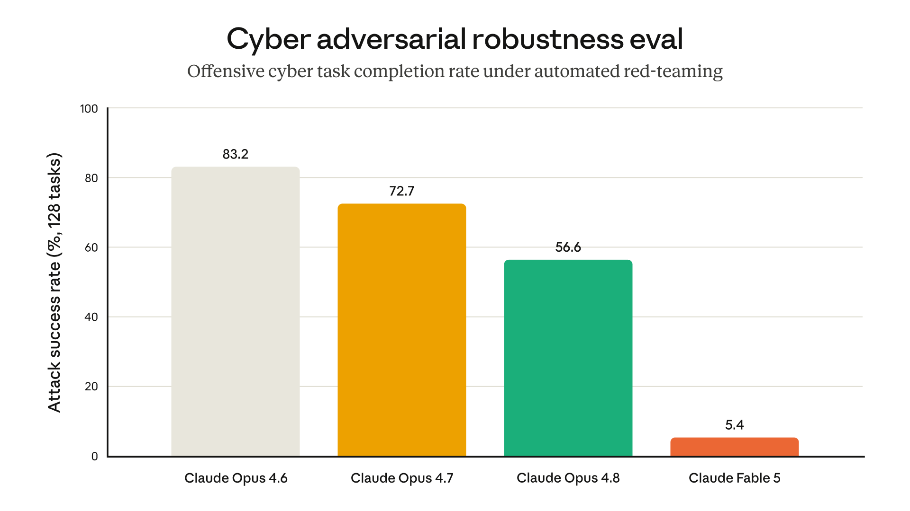
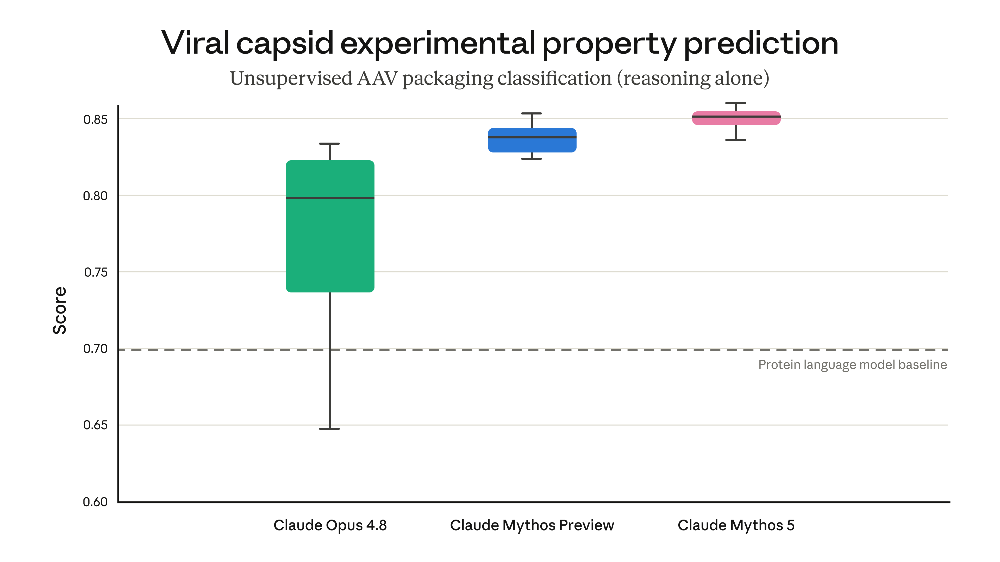

# Claude Fable 5 与 Claude Mythos 5

**来源：**[原文链接](https://www.anthropic.com/news/claude-fable-5-mythos-5)

**本地保存日期：**2026-07-28

> 今天，我们正式推出 Claude Fable 5：一款经过安全处理、可供广泛使用的 Mythos 级模型。

公告2026 年 6 月 9 日

- 更新

  Claude Mythos 5 与 Fable 5 已重新上线

  2026 年 7 月 1 日

  Claude Fable 5 与 Mythos 5 现已恢复使用。

  

  阅读更多

- Claude Mythos 5 与 Fable 5 暂时无法访问

  2026 年 6 月 12 日

  我们正在暂停 Claude Fable 5 与 Claude Mythos 5 的访问。对于给客户造成的影响，我们深表歉意，并正努力尽快恢复服务。

  

  阅读更多

今天，我们正式推出 **Claude Fable 5**：一款经过安全处理、可供广泛使用的 Mythos 级[1](#脚注)模型。

Fable 5 的能力超越了我们以往向公众开放的所有模型。在几乎所有经过测试的 AI 能力基准上，它都达到了当前最佳水平，在软件工程、知识工作、视觉、科学研究及许多其他领域展现出卓越性能。任务越长、越复杂，Fable 5 相比我们其他模型的领先优势就越大。

发布如此强大的模型也伴随着风险。如果没有安全防护，Fable 5 在网络安全等领域的能力可能会被滥用，造成严重损害。因此，我们为模型配备了安全防护：针对某些主题的查询，将改由我们能力仅次于它的模型 Claude Opus 4.8 作答。为了既安全又迅速地发布模型，我们对这些安全防护采取了较为保守的调校——它们有时会拦截无害请求，不过平均而言，触发此机制的会话不到 5%。未来几个月还会有能力更强的模型问世，我们正竭力改进安全防护，并尽快减少误报。

我们还面向一小部分网络防御人员和基础设施提供商推出 **Claude Mythos 5**。它与 Fable 5 使用相同的底层模型，但取消了部分领域的安全防护。[2](#脚注) Mythos 5 初期将通过 [Project Glasswing](https://www.anthropic.com/glasswing) 部署，并与美国政府合作，作为 Claude Mythos Preview 的升级版本。它具备全球所有模型中最强的网络安全能力。我们计划不久后通过范围更广的可信访问计划，扩大 Mythos 5 的使用范围。

Fable 5 和 Mythos 5 这类模型的能力有望为世界带来深远的益处。我们已在 Project Glasswing 中看到了开端：这些模型曾[帮助网络防御人员](https://www.anthropic.com/research/glasswing-initial-update)保护至关重要的软件。我们也在生命科学研究中看到了这种潜力，模型正在提出新颖假说，并加速新疗法的研发。

Fable 5 与 Mythos 5 的定价为每百万输入 token \$10、每百万输出 token \$50——不到 Claude Mythos Preview 价格的一半。今天同时发布这两款模型，是我们朝着既定目标迈出的又一步：尽可能迅速、安全地将先进 AI 能力带给尽可能多的用户。

## 评估 Claude Fable 5 与 Claude Mythos 5

下表将 Fable 5 和 Mythos 5 的能力与其他领先模型进行了比较。

  
Fable 5 与 Mythos 5 能够自主工作的时长超过以往任何 Claude 模型。下文将介绍这些能力如何应用于软件工程，并说明该模型在知识工作、视觉、记忆和生命科学研究方面的能力提升。

*软件工程。* 在早期测试中，[Stripe](https://stripe.com/) 表示，Fable 5 将数月的工程工作压缩到了数天。在一个拥有 5,000 万行代码的 Ruby 代码库中，该模型仅用一天就完成了全代码库迁移；若完全由人工执行，整个团队需要两个多月。Fable 5 的 token 使用效率也高于以往的 Claude 模型：在 Cognition 的 [FrontierCode](https://cognition.ai/blog/frontier-code) 评测中——该评测考察模型能否在满足高质量生产代码库标准的同时完成高难度编程任务——即使只使用中等推理强度，Fable 5 在前沿模型中也取得了最高分。

*知识工作*。Fable 5 在复杂分析任务上表现强劲。在 [Hebbia](https://www.hebbia.com/) 面向资深级推理的 Finance Benchmark 中，Fable 5 的得分高于所有其他模型，在基于文档的推理、图表解读和问题解决方面均有显著提升。[IMC](https://www.imc.com/) 指出，Fable 5 几乎全面出色通过了他们的交易分析评测，包括事实检索、概念推理、根因分析和期望值分析。

*视觉。* Fable 5 成为视觉任务上新的当前最佳模型。它能从复杂的科学图表中提取精确数值，也能完成复杂的视觉任务，例如仅凭截图重建 Web 应用的源代码。它对辅助框架的依赖也更少：例如，以往的 Claude 模型即使配有提供额外实用工具的运行框架（harness），仍难以通关《宝可梦 火红》；而 Fable 5 仅凭一个极简的纯视觉运行框架便通关了游戏。

Claude 仅使用原始游戏截图——没有地图、导航辅助或额外的游戏状态信息——从头到尾游玩《宝可梦 火红》的延时记录。早期 Claude 模型需要复杂的辅助运行框架才能游玩《宝可梦》；Claude Fable 5 则仅凭视觉就完成了游戏。

*记忆与长上下文。* 面对跨越数百万 token 的长时间任务，Fable 5 仍能保持专注，并利用自己的笔记改进输出。我们让模型游玩牌组构筑游戏 [*Slay the Spire*](https://en.wikipedia.org/wiki/Slay_the_Spire) 时，为其提供持久化的文件式记忆后，性能提升幅度是 Opus 4.8 的三倍；Fable 抵达游戏最终幕的频率也高出三倍。

Claude Fable 5 构建了这个太阳系模拟程序，从物理学第一性原理推导行星的轨道运动，并用它预测日食。

*药物设计：* 借助 Mythos 5，我们内部的蛋白质设计专家将药物设计流程中部分环节的速度提升了约 10 倍。在一个案例中，他们发现 Mythos 5 在配备蛋白质设计和生物信息学工具、但无人类协助的情况下，表现可以媲美甚至超越熟练的人工操作人员。在此过程中，模型执行了一名科学家通常需要完成的全部任务：选择结合位点、选用并运行蛋白质设计工具，以及在遇到失败时自行恢复。这项研究涉及的 14 个蛋白质靶点中，有 9 个（如下图所示）产出了颇具潜力的候选药物设计方案，我们目前正在研究这些方案。

*Mythos 5 设计的蛋白质复合物。靶点包括免疫检查点、生长因子与受体信号通路、神经退行性疾病、肌肉疾病，以及更具难度的结构靶点。*

*分子生物学的新颖假说。* Mythos 5 是我们首个能够持续提出新颖且有说服力的科学假说的模型。在与 Opus 级模型开展的盲测一对一比较中，我们的科学家约 80% 的时候更青睐 Mythos 提出的分子生物学假说，并已将其中数个推进至实验评估阶段。与此同时，Mythos 提出的一个假说——关于一种*大肠杆菌*蛋白质的新机制——已得到另一家独立研究同一问题的实验室所发表的[一项研究](https://www.biorxiv.org/content/10.64898/2026.03.12.711259v1)佐证。

*基因组学的创新研究。* Mythos 5 用一周多时间开展了大体自主的创新基因组学研究。它汇集了涵盖 138 种动物、数百万个细胞的单细胞数据，并设计、训练了一个定制机器学习模型，用于识别即便在亲缘关系很远的生物体中承担相同功能的细胞。在仅获得人类高层指导的情况下，Mythos 5 训练出的模型优于近期发表于 *Science* 期刊的一款模型——尽管其规模小了 100 倍。我们计划在未来几个月发布这些结果。

*对齐*。在自动化对齐评估中，我们发现 Mythos 5 的不对齐行为水平较低，与 Opus 4.8 相近；这些行为包括模型采取的欺骗等不对齐行动，以及配合用户滥用模型。由于二者采用相同的底层模型，Fable 5 的对齐水平应当与之相近。模型的[系统卡](https://anthropic.com/claude-fable-5-mythos-5-system-card)完整介绍了这项评估，以及一套详尽的其他安全性与能力测试。

*自动化对齐评估中的不对齐行为总体水平。更多信息请参阅系统卡第 6.2.3.1 节。*

## Claude Fable 5 的早期反馈

获得早期访问权限的客户自行对 Fable 5 进行了测试。以下摘录了他们对测试结果的原话：

> Claude Fable 5 是 CursorBench 上当前最佳的模型。它为我们打开了一类长周期问题的大门，而这些问题曾是早期模型力所不及的。

> Claude Fable 5 对 GitHub 所服务的开发者而言是一次真正的飞跃。在早期测试中，它以超越以往基准的自主性与可靠性，承担起复杂的长周期编程任务。但最令我们振奋的，是它所指向的未来：开发者可以将越来越宏大的工作交给智能体，并在整个软件生命周期中信任其成果。

> 这是我们有机会测试过的所有 Claude 模型中最强的结果。Claude Fable 5 在智能体式（agentic）编程与原型开发方面无疑迈出了一大步。

> Claude Fable 5 的推理能力明显超越 Opus 4.8。它能以资深研究科学家的水准工作——选定方向、分配资源、摒弃自身的错误认知，并从第一性原理出发产出创新成果。

> Claude Fable 5 理解构建者的真正意图，而不只是他们输入的文字。一年前需要一百条提示词才能完成的应用，如今它一次就能生成。当客户真的遭遇瓶颈时，我们会选择这个模型来帮助他们迅速突破难关，完成最初想要构建的产品。

> Claude Fable 5 给人的感觉有实质性的不同。在盲评中，我们的律师发现，它给出的每一份修订稿都不逊于甚至优于我们目前使用的模型。

> 在最高推理强度下，Claude Fable 5 会反思并验证自己的工作。对我们而言，正是这一点让高度自主的操作成为可能——额外的思考完全值得。

> Claude Fable 5 以比以往模型更少的交互轮次，完成能力更强的工程工作——足以处理我们的员工每天在 Claude Code 中运行的复杂多智能体工作流。

> Claude Fable 5 是 Cognition 前沿编程评测 FrontierBench 上得分最高的模型。它擅长长周期推理，并且无需额外适配，就能举一反三地使用陌生工具。

> Claude Fable 5 是我们测试过的最强金融优先模型，无论一般金融能力还是推理能力皆是如此。这是一次显著提升。

> Claude Fable 5 是首个在我们的核心分析基准上突破 90% 的模型；该基准涵盖复杂、长时间运行的分析任务——它比 Opus 高出 10 个百分点。在最困难的问题上，它展现出出色的判断力和对细微差别的敏锐关注。

> Claude Fable 5 是我们在前沿物理学研究上测试过的最强模型，而它使用的推理 token 仅为三分之一。它只用 36 小时，就几乎达到了 GPT-5.5 花费四天才取得的成果。

> 在我们的端到端氛围编程基准 ViBench 上，Claude Fable 5 是我们测试过表现最好的模型——它几乎完全攻克了我们的基础用例，并用更少的时间和 token 构建出应用。

> 在我们的日常电子表格测试套件中，无论采用何种推理强度，Claude Fable 5 都胜过 Opus 4.8——而且所需交互轮次更少，完成测试的速度快 25–30%。

01 / 14

## Claude Fable 5 的新安全防护

Mythos 级模型的能力已经达到一个会带来重大风险的临界点。今年 4 月，我们启动了 [Project Glasswing](https://www.anthropic.com/glasswing)，仅向一小部分网络防御人员和关键软件基础设施提供商发布了首个 Mythos 级模型（Claude Mythos Preview）。当时我们曾表示，只要能开发出足够强大、可切实防止滥用的新安全防护，便希望最终能[向所有用户开放 Mythos 级能力](https://www.anthropic.com/glasswing#:~:text=We%20do%20not,Preview3.)。

过去几个月里，我们不断改进这些安全防护，如今它们已足够稳健，可以支持广泛发布。由于我们将安全置于优先地位，特意把安全防护调校得较为谨慎，因此其严格程度目前仍不尽理想——例如，一些无害请求有时也会触发分类器。我们知道这会让部分用户感到沮丧；我们的目标是在发布后持续更新和完善安全防护，从而减少误报。

下面将依次介绍 Fable 5 的各项新安全防护。模型的[系统卡](https://anthropic.com/claude-fable-5-mythos-5-system-card)与我们最新的[风险报告](https://cdn.sanity.io/files/4zrzovbb/website/097c63b5fe7dd8b14866e1f15bb1910ec713658a.pdf)对我们更广泛的安全防护体系进行了讨论和评估。

### 安全分类器

Mythos 级模型在前沿网络安全与研究生物学方面的能力，意味着它们可能为恶意行为者带来显著的*能力增益（uplift）*。也就是说，这些模型可能提供这些行为者无法从其他来源（例如互联网搜索引擎）获取的信息或建议，从而帮助他们造成严重伤害。此外，AI 模型的许多高级用途都具有双重用途属性：网络安全专业人员和生物学研究人员手中的有益查询，一旦落入恶意行为者手中，就可能带来危险。

因此，我们需要强大的安全防护来防止滥用，而且覆盖范围必须足够广。这些安全防护本身还必须经受住持续且复杂的规避尝试（也称为对系统实施“越狱”）。Mythos 级能力带来的增益对许多对手而言都很有价值——例如，可能从网络攻击中获利的人——因此我们预计他们会有很强的动机尝试绕过我们的安全措施。

Fable 5 配备了一套新的*分类器（classifiers）*：它们是独立的 AI 系统，用于检测潜在滥用（包括越狱尝试），并阻止主模型（在这里即 Fable 5）作答。我们在模型上运行分类器[已有一段时间](https://www.anthropic.com/research/next-generation-constitutional-classifiers)，Fable 5 的分类器是在以往工作的基础上扩展而来，覆盖范围更广。

当 Fable 的分类器检测到与网络安全、生物学和化学或蒸馏有关的请求时，将自动改由 Claude Opus 4.8 处理响应。每当发生这种情况，用户都会收到通知。Opus 4.8 本身就是一款能力非常强大的模型：回退（fallback）至 Opus 所带来的体验，远胜于 Fable 直接拒绝响应。我们的早期数据显示，超过 95% 的 Fable 会话完全不会发生回退——在这些会话中，Fable 5 的表现实际上与 Mythos 5 相同。

分类器覆盖以下领域：

1\. *网络安全。* Mythos 级模型[擅长](https://red.anthropic.com/2026/mythos-preview/)发现并利用软件漏洞，因此能大幅降低实施网络攻击的难度和成本。Mythos 级模型在智能体式黑客攻击方面也展现出强大能力。除了寻找漏洞外，这还涉及执行网络攻击中的多个不同环节——侦察、发现、横向移动等。为防止这些智能体式黑客能力提升网络攻击水平，我们设计的网络安全分类器不仅覆盖漏洞利用，也在更广泛意义上覆盖进攻性网络任务。如下图所示，我们的分类器会阻止 Fable 在这些任务上取得任何进展。

*网络安全评测的运行结果。³ Fable 5 采用阻止响应而非回退到 Opus 4.8 的模式。评测未尝试规避安全防护。*

我们对分类器进行了广泛的红队测试，以检验其抵御越狱的稳健性。除内部测试外，我们还开展了外部漏洞赏金计划；经过 1,000 多小时的测试，没有发现任何通用越狱方法。我们聘请的外部红队组织迄今同样未能在长篇智能体式任务中发现任何通用越狱方法——不过，英国 AISI 在短暂的初步测试窗口内已朝着找到一种方法取得进展。[4](#脚注) 要*彻底*阻止通用越狱很可能并不现实，但我们的目标是让所有残余越狱方法都变得足够缓慢、成本足够高，以便我们在它们被大规模使用前加以检测和阻止。

下图来自我们的一项内部评估，展示了 Fable 5 的安全防护如何使其比以往面向公众开放的模型更能抵御越狱。

*在一项内部评估中，自动化红队程序尝试让模型在 400 轮交互中完成一项与进攻性网络安全有关的短任务，并在受阻时重启和倒回。任务大多比较简单，不能代表真实的网络安全用途——有时甚至只是对远程服务器上的文件进行加密。对于更复杂、更贴近现实的任务，我们尚未在生产系统上发现成功的越狱。请注意，Opus 4.6 没有阻断式网络安全防护。*

我们的一个外部合作伙伴发现，在所有受测模型（包括 Opus 4.8 和 Opus 4.7）中，Fable 5 针对有害网络安全查询的防护最为稳健。对于涉及策划网络攻击、漏洞利用开发或规避防御的有害单轮请求，Fable 5 的遵从次数为零。无论请求是否使用 30 种不同公开越狱技术中的任何一种，这一结果都成立。

2\. *生物学与化学。* 长期以来，我们一直使用[分类器](https://www.anthropic.com/news/activating-asl3-protections)，阻止模型响应少数几类与生物武器有关的查询。但我们已无法确定，仅阻止这一狭窄范围的查询是否足够。原因有二：首先，我们有理由担忧，资源充足的恶意行为者可能尝试借助我们的模型提升从事高风险生物学研究的能力。其次，模型如今完成现实世界科学任务的能力也更强了。

例如，我们测试了 Mythos 5 在设计[腺相关病毒](https://en.wikipedia.org/wiki/Adeno-associated_virus)（AAV）时完成某个高难度步骤的能力。AAV 是递送基因疗法的一种载体，但同样的能力如果落入不当之手，也可能被用于设计危险病毒。在这项任务中，我们评估了多种 AI 模型预测基因改造将如何影响病毒外壳组装的能力（候选对象来自由 [Dyno Therapeutics](https://www.dynotx.com/) 开发的一组具有治疗价值、尚未公开的候选病毒）。我们并未明确训练模型来执行这项任务——然而，Mythos 级模型仅凭生物学推理，就超越了专门针对蛋白质任务设计的先进模型（称为“蛋白质语言模型”）。这表明模型在完成基因治疗研发中简单但重要的任务方面具有可喜的能力——同时也凸显出此类双重用途能力所带来的风险。

*在一项评估中，我们的模型预测了一种简单病毒外壳尚未公开的实验特性。在此情境下，病毒外壳组装是最容易预测的病毒特征，但在设计更复杂特征时，它仍是一项必须准确把握的重要属性。AAV = 腺相关病毒。*

我们的首要任务是尽快安全发布 Fable，即使代价是安全防护范围过宽。因此，目前我们已安排 Fable 对大多数与生物学和化学有关的请求回退至 Opus 4.8。与所有分类器一样，我们希望尽快缩小这些安全防护的范围：从上文证据可以看出，Fable 在科学领域的正面应用潜力巨大，我们不希望分类器的误报对此造成阻碍。未来几周内，一些生物医学研究人员和企业将可以加入我们的 Mythos 5 生物学能力可信访问计划（下文将作介绍）。

3\. *蒸馏。* 我们此前曾发现，有人[大规模尝试](https://www.anthropic.com/news/detecting-and-preventing-distillation-attacks)提取（即“蒸馏”）Claude 的能力，用于训练威权国家的[竞争](https://www.anthropic.com/legal/commercial-terms)模型。蒸馏 Fable 5 的能力可能会间接导致接近前沿水平的 AI 能力扩散——而这些能力可能在没有适当安全防护的情况下发布。被分类器标记为此类蒸馏尝试组成部分的请求，将回退至 Opus 4.8。

### 新的数据保留政策

最后，我们将调整 Fable 5、Mythos 5 及未来能力相当或更强模型的企业客户数据处理方式。对于 Mythos 级模型上的所有流量，无论来自第一方还是第三方界面，我们都将要求保留 30 天。我们不会使用这些数据训练新的 Claude 模型，也不会将其用于任何与安全无关的目的；同时，我们已建立新的隐私保护措施，包括记录所有人工访问数据的行为，并确保数据在几乎所有情况下都于 30 天后删除（更多详情请参阅[这篇文章](https://support.claude.com/en/articles/15425996)）。这些数据将帮助我们抵御复杂的新型攻击（包括新的越狱方法，以及跨越大量请求实施的攻击），也有助于我们识别并减少误报。

## Claude Mythos 5 与可信访问计划

从今天起，所有目前有权访问 Claude Mythos Preview 的用户（例如 Project Glasswing 中的网络安全合作伙伴）都可以升级到 Claude Mythos 5——它与 Claude Fable 5 是同一款模型，但取消了网络安全防护。用户会发现，Mythos 5 在大多数情况下与 Mythos Preview 相当或略胜一筹，而成本则低得多。

我们计划与美国政府协商，稳步扩大 Claude Mythos 5 的访问范围；除了继续[定期加入](https://www.anthropic.com/news/expanding-project-glasswing)新合作伙伴，也将推进一项可信访问计划，让网络安全组织能够以更系统化的方式提出申请。

我们的计划还包括为生物学开放可信访问计划，借助 Mythos 级能力加速生物医学研究与新疗法发现。该计划将提供 Fable 5 的访问权限，并移除其生物学与化学安全防护（但仍保留网络安全防护）。计划将招募来自各类生命科学组织、从事基础研究和转化研究的少量研究人员；我们打算在持续改进安全防护的同时扩大该计划的访问范围。  

## 可用性

Claude Fable 5 今天已在所有地区上线。在范围更广的可信访问计划推出之前，Claude Mythos 5 仅限 Glasswing 合作伙伴（已移除网络安全防护）以及即将获准使用的部分生物学研究人员（已移除生物学与化学安全防护）访问。

两款模型的定价均为每百万输入 token \$10、每百万输出 token \$50。开发者可通过 [Claude API](https://platform.claude.com/docs/en/about-claude/models/overview) 使用 claude-fable-5。

我们预计 Fable 5 的需求会非常旺盛，而且难以预测。从今天起，Fable 5 已在 Claude API 和按用量计费的 Enterprise 方案中全面开放。对于订阅方案，我们希望让用户尽早获得访问权限，因此将采取更为审慎的分阶段上线方式：

- 从今天到 6 月 22 日，Pro、Max、Team 和按席位计费的 Enterprise 方案将免费包含 Fable 5。
- 6 月 23 日，我们会从这些方案中移除 Fable 5。此后若要继续使用，需要购买[用量点数](https://support.claude.com/en/articles/12429409-manage-usage-credits-for-paid-claude-plans)。如果容量允许，我们会延长免费包含期。
- 此后，一旦容量充足，我们计划恢复 Fable 5，将其作为订阅方案的标准组成部分。我们会尽快实现这一目标。

在此期间，我们会提前告知任何变动，让用户随时了解最新情况。

*编辑于 2026 年 6 月 9 日：更新了关于 AAV 的讨论，注明候选病毒由 Dyno Therapeutics 开发。*

#### 脚注

1.  Mythos 级模型是 Claude 模型中的一个能力层级，位于 Opus 级之上。首款此类模型 Claude Mythos Preview 于 4 月通过 [Project Glasswing](https://www.anthropic.com/glasswing) 发布。今天紧随其后的是 Claude Fable 5 与 Claude Mythos 5。
2.  Fable 源自拉丁语 *fabula*，意为“被讲述之事”，与希腊语 *mythos* 含义相近。安全防护是区分这两个模型（Fable 与 Mythos）的关键，也正是我们为它们采用不同名称的原因。
3.  指标：Firefox = 实现任意代码执行的试验占比（漏洞利用的完全成功等级）。OSS-Fuzz = 五级评分的严重程度加权平均值（0.2 表示崩溃 → 1.0 表示控制流劫持），因此该数值是加权平均值而非成功率。CyberGym = 成功复现目标漏洞的占比（公开排行榜采用的指标）。CyScenarioBench = 在各项挑战中等权平均的成功率。
4.  通用越狱可以定义为：任何能让用户像模型不存在安全防护一样与之交互的提示词、脚本或运行框架。与之相对的是较轻微的越狱方法，它们仅在极为有限的情境下有效，或需要付出额外努力才能适配每一种新情况。

## 相关内容

### 我们对开放权重模型的立场

### Cognizant 与 Anthropic 扩大合作，将 Claude 带给企业客户

### Claude Opus 5 正式发布

Opus 5 为 Opus 层级带来了跨越式提升，既能驱动长时间运行的智能体，也改进了编程和专业工作能力。
